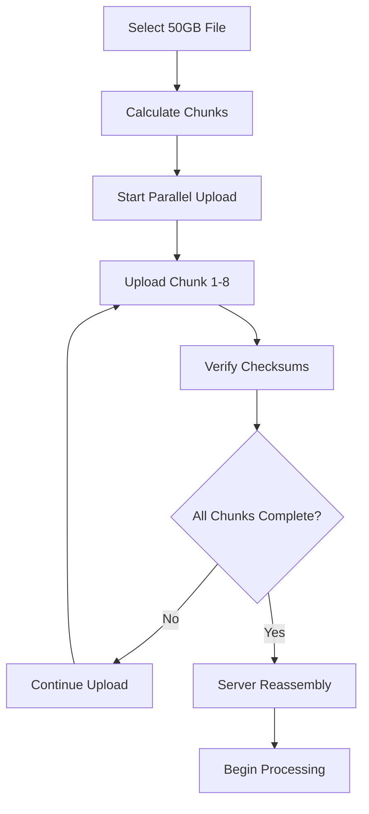

# Large GeoTIFF Files Guide (50GB+)

## Overview
This guide covers handling extremely large GeoTIFF files (50GB+) in the Leaflet Viewer, including the technical approach, user experience considerations, and optimization strategies.

## File Size Categories

| Size Range | Processing Approach | Expected Performance | Infrastructure |
|------------|-------------------|-------------------|---------------|
| < 100MB | Client-side only | < 5 seconds load | Browser only |
| 100MB - 1GB | Hybrid client/server | < 15 seconds load | Optional server |
| 1GB - 10GB | Server-side primary | < 30 seconds load | Required server |
| 10GB - 50GB | Server-side only | < 2 minutes load | Enterprise server |
| 50GB+ | Distributed processing | < 5 minutes load | Cloud infrastructure |

## Large File Processing Pipeline

### 1. Upload Process for 50GB+ Files

#### Chunked Upload Strategy
```
File: 49.67 GB GeoTIFF
├── Split into 500 chunks of ~100MB each
├── Upload chunks in parallel (4-8 concurrent)
├── Verify chunk integrity with checksums
├── Reassemble on server with validation
└── Begin processing pipeline
```

#### Upload Flow


### 2. Server-Side Processing Pipeline

#### Phase 1: File Validation & Analysis
```bash
# GDAL commands for large file processing
gdalinfo /path/to/large-file.tif
gdal_translate -of COG -co COMPRESS=LZW -co TILED=YES \
  /path/to/large-file.tif /path/to/optimized.cog.tif

# Generate overviews (pyramid levels)
gdaladdo -r average /path/to/optimized.cog.tif 2 4 8 16 32 64
```

#### Phase 2: Tile Generation
```python
# Python script for tile generation
import gdal
from osgeo import gdal_array
import numpy as np

def generate_tiles(input_file, output_dir, tile_size=512):
    dataset = gdal.Open(input_file)
    
    # Calculate tile grid
    width = dataset.RasterXSize
    height = dataset.RasterYSize
    tiles_x = (width + tile_size - 1) // tile_size
    tiles_y = (height + tile_size - 1) // tile_size
    
    # Generate tiles at multiple zoom levels
    for zoom in range(18):  # 18 zoom levels
        for x in range(tiles_x >> (18-zoom)):
            for y in range(tiles_y >> (18-zoom)):
                generate_single_tile(dataset, x, y, zoom, output_dir)
```

#### Phase 3: Metadata Extraction
```json
{
  "file_id": "uuid-v4",
  "original_size": 53297561600,
  "processed_size": 25648780800,
  "dimensions": {
    "width": 50000,
    "height": 40000,
    "bands": 3
  },
  "geospatial": {
    "projection": "EPSG:4326",
    "bounds": {
      "north": 45.123456,
      "south": 44.123456,
      "east": -122.123456,
      "west": -123.123456
    },
    "resolution": [0.0001, 0.0001]
  },
  "processing": {
    "cog_optimized": true,
    "compression": "LZW",
    "tile_count": 15625,
    "pyramid_levels": 8,
    "processing_time_seconds": 1847
  }
}
```

## Client-Side Handling

### 1. Progressive Loading Strategy
```typescript
interface TileLoadingStrategy {
  // Load low-resolution overview first
  loadOverview(): Promise<void>;
  
  // Load tiles based on viewport
  loadVisibleTiles(viewport: ViewportBounds): Promise<void>;
  
  // Preload adjacent tiles
  preloadAdjacentTiles(currentTiles: TileCoordinate[]): Promise<void>;
  
  // Manage memory pressure
  evictUnusedTiles(memoryThreshold: number): void;
}
```

### 2. Memory Management
```typescript
class LargeTileManager {
  private tileCache = new Map<string, TileData>();
  private readonly MAX_MEMORY_MB = 2048; // 2GB browser limit
  
  loadTile(tileId: string): Promise<TileData> {
    // Check memory usage
    if (this.getMemoryUsage() > this.MAX_MEMORY_MB * 0.8) {
      this.evictOldestTiles();
    }
    
    // Load tile from server
    return this.fetchTileFromServer(tileId);
  }
  
  private evictOldestTiles(): void {
    // LRU eviction strategy
    const sortedTiles = Array.from(this.tileCache.entries())
      .sort((a, b) => a[1].lastAccessed - b[1].lastAccessed);
    
    // Remove oldest 25% of tiles
    const tilesToRemove = sortedTiles.slice(0, sortedTiles.length * 0.25);
    tilesToRemove.forEach(([tileId]) => {
      this.tileCache.delete(tileId);
    });
  }
}
```

### 3. Viewport-Based Loading
```typescript
class ViewportTileLoader {
  private currentViewport: ViewportBounds;
  private loadedTiles = new Set<string>();
  
  onViewportChange(newViewport: ViewportBounds): void {
    this.currentViewport = newViewport;
    
    // Calculate required tiles for current zoom level
    const requiredTiles = this.calculateRequiredTiles(newViewport);
    
    // Load missing tiles
    const missingTiles = requiredTiles.filter(
      tileId => !this.loadedTiles.has(tileId)
    );
    
    this.loadTilesInPriority(missingTiles);
  }
  
  private loadTilesInPriority(tiles: string[]): void {
    // Load center tiles first, then expand outward
    const sortedTiles = tiles.sort((a, b) => {
      const distanceA = this.distanceFromCenter(a);
      const distanceB = this.distanceFromCenter(b);
      return distanceA - distanceB;
    });
    
    sortedTiles.forEach((tileId, index) => {
      setTimeout(() => this.loadTile(tileId), index * 50);
    });
  }
}
```

## Performance Optimization

### 1. Server-Side Optimizations
```yaml
# Kubernetes resource allocation for large file processing
apiVersion: apps/v1
kind: Deployment
metadata:
  name: geotiff-processor-large
spec:
  replicas: 2
  template:
    spec:
      containers:
      - name: processor
        image: geotiff-processor:latest
        resources:
          requests:
            memory: "16Gi"
            cpu: "4000m"
          limits:
            memory: "32Gi"
            cpu: "8000m"
        env:
        - name: GDAL_CACHEMAX
          value: "8192"  # 8GB GDAL cache
        - name: MAX_WORKERS
          value: "8"
```

### 2. CDN Configuration
```nginx
# Nginx configuration for tile serving
location /tiles/ {
    # Cache tiles for 1 year
    expires 1y;
    add_header Cache-Control "public, immutable";
    
    # Compress tiles
    gzip on;
    gzip_types image/png image/jpeg image/webp;
    
    # Enable HTTP/2 push for adjacent tiles
    http2_push /tiles/adjacent-tile-1.png;
    http2_push /tiles/adjacent-tile-2.png;
    
    # Serve from cloud storage
    proxy_pass https://your-cdn.cloudfront.net/tiles/;
}
```

### 3. Database Optimization
```sql
-- Optimized schema for tile metadata
CREATE TABLE tile_metadata (
    id SERIAL PRIMARY KEY,
    file_id UUID NOT NULL,
    zoom_level INTEGER NOT NULL,
    tile_x INTEGER NOT NULL,
    tile_y INTEGER NOT NULL,
    storage_url TEXT NOT NULL,
    file_size INTEGER,
    checksum VARCHAR(64),
    created_at TIMESTAMP DEFAULT NOW()
);

-- Indexes for fast tile lookup
CREATE INDEX idx_tile_lookup ON tile_metadata (file_id, zoom_level, tile_x, tile_y);
CREATE INDEX idx_file_tiles ON tile_metadata (file_id);

-- Partitioning for large datasets
CREATE TABLE tile_metadata_z0_5 PARTITION OF tile_metadata
    FOR VALUES FROM (0) TO (6);
CREATE TABLE tile_metadata_z6_12 PARTITION OF tile_metadata
    FOR VALUES FROM (6) TO (13);
CREATE TABLE tile_metadata_z13_18 PARTITION OF tile_metadata
    FOR VALUES FROM (13) TO (19);
```

## User Experience Considerations

### 1. Upload Progress Tracking
```typescript
interface UploadProgress {
  fileId: string;
  fileName: string;
  totalSize: number;
  uploadedSize: number;
  uploadSpeed: number; // bytes per second
  estimatedTimeRemaining: number; // seconds
  chunksCompleted: number;
  chunksTotal: number;
  status: 'uploading' | 'processing' | 'complete' | 'error';
  canPause: boolean;
  canResume: boolean;
}
```

### 2. Processing Status
```typescript
interface ProcessingStatus {
  stage: 'validation' | 'conversion' | 'tiling' | 'optimization' | 'complete';
  progress: number; // 0-100
  message: string;
  estimatedTimeRemaining: number;
  currentOperation: string;
  tilesGenerated: number;
  totalTiles: number;
}
```

### 3. Viewing Experience
```typescript
interface ViewingExperience {
  // Show low-res preview immediately
  showPreview(): void;
  
  // Progressive quality improvement
  enhanceQuality(viewport: ViewportBounds): void;
  
  // Smart preloading
  preloadNearbyAreas(): void;
  
  // Memory usage indicator
  showMemoryUsage(): string;
  
  // Connection quality adaptation
  adaptToConnection(speed: 'slow' | 'medium' | 'fast'): void;
}
```

## Error Handling & Recovery

### 1. Upload Failures
```typescript
class RobustUploader {
  async uploadLargeFile(file: File): Promise<void> {
    const chunks = this.createChunks(file, 100 * 1024 * 1024); // 100MB chunks
    const failedChunks: number[] = [];
    
    try {
      await Promise.allSettled(
        chunks.map((chunk, index) => this.uploadChunk(chunk, index))
      );
    } catch (error) {
      // Retry failed chunks
      for (const chunkIndex of failedChunks) {
        await this.retryChunk(chunks[chunkIndex], chunkIndex);
      }
    }
  }
  
  private async retryChunk(chunk: Blob, index: number, maxRetries = 3): Promise<void> {
    for (let attempt = 1; attempt <= maxRetries; attempt++) {
      try {
        await this.uploadChunk(chunk, index);
        return;
      } catch (error) {
        if (attempt === maxRetries) {
          throw new Error(`Failed to upload chunk ${index} after ${maxRetries} attempts`);
        }
        await this.delay(1000 * attempt); // Exponential backoff
      }
    }
  }
}
```

### 2. Processing Failures
```python
# Python error handling for GDAL processing
import logging
from retry import retry

@retry(tries=3, delay=60, backoff=2)
def process_large_geotiff(input_path, output_path):
    try:
        # Validate input file
        dataset = gdal.Open(input_path)
        if dataset is None:
            raise ValueError("Invalid GeoTIFF file")
        
        # Check available memory
        import psutil
        available_memory = psutil.virtual_memory().available
        if available_memory < 8 * 1024 * 1024 * 1024:  # 8GB
            raise MemoryError("Insufficient memory for processing")
        
        # Process file
        gdal.Translate(output_path, input_path, 
                      format='COG',
                      creationOptions=['COMPRESS=LZW', 'TILED=YES'])
        
    except Exception as e:
        logging.error(f"Processing failed: {str(e)}")
        raise
```

## Monitoring & Analytics

### 1. Performance Metrics
```typescript
interface LargeFileMetrics {
  uploadTime: number;
  processingTime: number;
  firstTileTime: number;
  fullLoadTime: number;
  averageTileLoadTime: number;
  memoryPeakUsage: number;
  tilesServed: number;
  cacheHitRate: number;
  userInteractionDelay: number;
}
```

### 2. Health Checks
```bash
#!/bin/bash
# health-check-large-files.sh

# Check processing queue length
QUEUE_LENGTH=$(redis-cli -h $REDIS_HOST LLEN processing_queue)
if [ $QUEUE_LENGTH -gt 10 ]; then
  echo "WARNING: Processing queue backed up ($QUEUE_LENGTH items)"
fi

# Check available storage
STORAGE_USAGE=$(df -h /data | awk 'NR==2 {print $5}' | sed 's/%//')
if [ $STORAGE_USAGE -gt 85 ]; then
  echo "WARNING: Storage usage high (${STORAGE_USAGE}%)"
fi

# Check GDAL processing memory
GDAL_PROCESSES=$(ps aux | grep gdal | wc -l)
if [ $GDAL_PROCESSES -gt 5 ]; then
  echo "WARNING: Many GDAL processes running ($GDAL_PROCESSES)"
fi
```

## Best Practices

### 1. File Preparation
- Convert to Cloud Optimized GeoTIFF (COG) format when possible
- Use appropriate compression (LZW, DEFLATE, or WEBP)
- Include proper overview pyramids
- Validate files before upload

### 2. System Configuration
- Allocate sufficient server memory (32GB+ recommended)
- Use SSD storage for processing
- Configure proper network timeouts
- Set up monitoring and alerting

### 3. User Communication
- Provide clear upload progress indicators
- Show processing status with time estimates
- Offer pause/resume capabilities
- Display memory usage warnings

---

**Performance Expectations for 49.67 GB File**:
- Upload time: 8-15 minutes (depending on connection)
- Processing time: 15-30 minutes (server-dependent)
- First view: 30-60 seconds
- Full quality load: 2-5 minutes
- Memory usage: <2GB browser, 16-32GB server